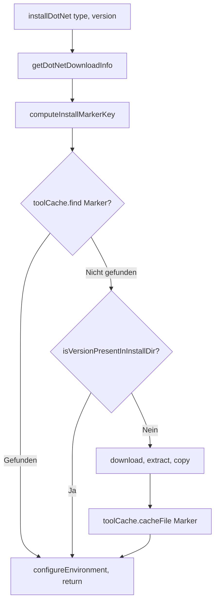

# Tool-Cache-Skip bei bereits vorhandener Installation (Self-Hosted)

## Problem

Auf Self-Hosted Runnern wird das Tool-Cache-Verzeichnis (`RUNNER_TOOL_CACHE` / `AGENT_TOOLSDIRECTORY`) über Jobs hinweg geteilt. Die Action installiert derzeit immer Download → Extract → Copy, auch wenn das Zielverzeichnis bereits die gewünschten .NET-Versionen enthält (z.B. von einem vorherigen Job oder nach `@actions/cache` restore).

## Lösungsansatz

Zwei Stufen vor Download/Install:

1. **Tool-Cache-Marker (`find` + `cacheFile`)**  

   - Eindeutiger Schlüssel pro (type, version, RID, file.hash) als semver-taugliche „Version“.  
   - Vor Install: `toolCache.find('dotnet-setup-markers', markerKey, arch)` – wenn gefunden → Skip.  
   - Nach erfolgreicher `copyToInstallDir`: Temp-Datei erzeugen, `toolCache.cacheFile(..., 'dotnet-setup-markers', markerKey, arch)` aufrufen, Temp-Datei löschen.

2. **On-Disk-Check**  

   - Falls `find` keinen Treffer liefert: prüfen, ob die Version schon im Installationsverzeichnis existiert (z.B. nach `restoreCache` oder manuell).  
   - SDK: `{installDir}/sdk/{version}/`  
   - Runtime: `{installDir}/shared/Microsoft.NETCore.App/{version}/`  
   - ASP.NET Core: `{installDir}/shared/Microsoft.AspNetCore.App/{version}/`  
   - Wenn vorhanden → Skip.

Nur wenn beide Prüfungen negativ sind: Download → Extract → Copy → Marker schreiben.

## Wichtige Details zur Tool-Cache-API

- **`find(toolName, versionSpec, arch?)`**  
  - Prüft `{RUNNER_TOOL_CACHE}/{toolName}/{versionSpec}/{arch}` und Datei `{path}.complete`.  
  - `versionSpec` muss für `isExplicitVersion` semver-valid sein, sonst wird `findAllVersions` + `evaluateVersions` verwendet (für unsere Hash-Strings ungeeignet).

- **`cacheFile(sourceFile, targetFile, tool, version, arch?)`**  
  - Legt `sourceFile` als `targetFile` unter `{RUNNER_TOOL_CACHE}/{tool}/{version}/{arch}/` ab und schreibt `.complete`.  
  - `version` wird mit `semver.clean(version) || version` gespeichert.

- **Marker-Key (semver-kompatibel)**  
  - `0.0.0-marker-` + erster Teil eines Hash von `{type}-{version}-{rid}-{file.hash}` (z.B. 16 Zeichen SHA-256 in Hex).  
  - Beispiele: `0.0.0-marker-a1b2c3d4e5f67890`.  
  - So ist `isExplicitVersion` erfüllt und `find` nutzt exakte Suche.

- **`find`/`cacheFile` und `RUNNER_TOOL_CACHE`**  
  - Beide nutzen nur `RUNNER_TOOL_CACHE`. Ist es nicht gesetzt, wirft `@actions/tool-cache` in `_getCacheDirectory` (Assert).  
  - `find`/`cacheFile` in try-catch: bei Fehler (z.B. fehlendes `RUNNER_TOOL_CACHE`) durchfallen lassen und normal installieren – keine Blockade in Sonderumgebungen.

## Betroffene Dateien

- [src/installer.ts](src/installer.ts): Hauptlogik (Marker-Key, `find`, On-Disk-Check, `cacheFile` nach Copy, Skip mit `configureEnvironment` + `InstallResult`).

## Änderungen in `installer.ts`

### 1. Hilfsfunktionen (oben, nach den bestehenden Helpers)

- **`computeInstallMarkerKey(type, version, fileHash, rid): string`**  
  - `crypto.createHash('sha256').update(\`${type}-${version}-${rid}-${fileHash}\`).digest('hex').substring(0, 16)`  
  - Rückgabe: `0.0.0-marker-${shortHash}`.

- **`isVersionPresentInInstallDir(installDir, type, version): boolean`**  
  - Prüft per `fs.existsSync`:
    - `sdk` → `path.join(installDir, 'sdk', version)`
    - `runtime` → `path.join(installDir, 'shared', 'Microsoft.NETCore.App', version)`
    - `aspnetcore` → `path.join(installDir, 'shared', 'Microsoft.AspNetCore.App', version)`  
  - Gibt `true` zurück, wenn das jeweilige Verzeichnis existiert.

### 2. `installDotNet` – Ablauf

- `getDotNetDownloadInfo(version, type)` wie bisher (liefert `url`, `hash`).
- RID: `getPlatform()`-`getArchitecture()` (z.B. `linux-x64`).
- `markerKey = computeInstallMarkerKey(type, version, hash, rid)`.
- **Skip 1 – Tool-Cache-Marker:**  
  - `try { if (toolCache.find('dotnet-setup-markers', markerKey, getArchitecture())) { configureEnvironment(getDotNetInstallDirectory()); return { version, type, path: getDotNetInstallDirectory() }; } } catch { /* durchfallen */ }`
- **Skip 2 – On-Disk:**  
  - `if (isVersionPresentInInstallDir(getDotNetInstallDirectory(), type, version)) { configureEnvironment(...); return { ... }; }`
- **Sonst:**  
  - Bisheriger Pfad: `downloadDotnetArchive` → `extractDotnetArchive` → `validateExtractedBinary` → `copyToInstallDir`.
- **Nach `copyToInstallDir`:**  
  - Temp-Datei: `const tmp = path.join(os.tmpdir(), \`dotnet-marker-${crypto.randomUUID()}\`); fs.writeFileSync(tmp, '');`  
  - `try { await toolCache.cacheFile(tmp, 'marker', 'dotnet-setup-markers', markerKey, getArchitecture()); } catch { /* nur Log, kein Abbruch */ } finally { fs.unlinkSync(tmp); }`
- Danach wie bisher: `configureEnvironment(installDir)`, `return { version, type, path: installDir }`.

### 3. Imports

- `os` und `path` sind bereits da; `crypto` schon.  
- `getArchitecture` aus `./utils/platform-utils` importieren (falls nur `getPlatform` importiert ist).

## Abhängigkeiten

- Keine neuen npm-Pakete.  
- `@actions/tool-cache` (find, cacheFile) und `fs`/`path`/`crypto`/`os` reichen aus.

## Beziehung zu bestehendem Cache (`@actions/cache`)

- **`restoreCache`/`saveCache`** in [src/utils/cache-utils.ts](src/utils/cache-utils.ts) bleiben unverändert.  
- Sie cachen das gesamte Installationsverzeichnis.  
- Nach `restoreCache` liegen die .NET-Dateien im Installationsverzeichnis, aber **kein** Tool-Cache-Marker (der liegt unter `dotnet-setup-markers` in `RUNNER_TOOL_CACHE`).  
- Daher ist der **On-Disk-Check** nötig: Er erkennt „bereits vorhanden“ auch nach `restoreCache` und vermeidet Re-Download.  
- Die Marker-Logik hilft vor allem bei Self-Hosted: Nach der ersten Installation schreiben wir den Marker; spätere Jobs auf demselben Runner finden ihn per `find` und überspringen Download/Install.

## Tests

- In [src/installer.test.ts](src/installer.test.ts):
  - `computeInstallMarkerKey`: deterministisch für (type, version, hash, rid); enthält `0.0.0-marker-` und 16 Hex-Zeichen.
  - `isVersionPresentInInstallDir`: `true`, wenn das erwartete Unterverzeichnis existiert; `false`, wenn nicht oder `installDir` fehlt.
- Für `installDotNet`:
  - Mock von `toolCache.find`: wenn ein Pfad zurückgegeben wird → kein `downloadTool`/`extractArchive`/`io.cp`; `configureEnvironment` wurde aufgerufen.
  - Mock von `toolCache.cacheFile` nach Copy: wird mit korrektem `tool`, `version` (= markerKey) und `arch` aufgerufen.

## Kurzablauf (logisch)

## Offene Punkte / Hinweise

- **`RUNNER_TOOL_CACHE` vs. `AGENT_TOOLSDIRECTORY`:**  
  - `getDotNetInstallDirectory` nutzt `AGENT_TOOLSDIRECTORY || RUNNER_TOOL_CACHE`.  
  - `find`/`cacheFile` nutzen nur `RUNNER_TOOL_CACHE`.  
  - Wenn beide gesetzt und unterschiedlich sind, liegen Installationsverzeichnis und Marker an verschiedenen Orten; der On-Disk-Check stellt trotzdem korrekt fest, ob die Version schon installiert ist. In typischen Runner-Setups sind die Werte gleich oder `RUNNER_TOOL_CACHE` gesetzt.

- **Parallelität:**  
  - `executeInstallPlan` ruft `installDotNet` parallel auf.  
  - `cacheFile` und `find` sind pro (type, version) eindeutig; Kollisionen nur bei gleichem markerKey, was nur für exakt gleiches (type, version, rid, hash) vorkommt – also derselbe Install, dann ist idempotentes nochmaliges Schreiben unkritisch.

- **Validierung:**  
  - Vor Merge: `pnpm validate` (Build, Format, Lint, Knip, Tests).