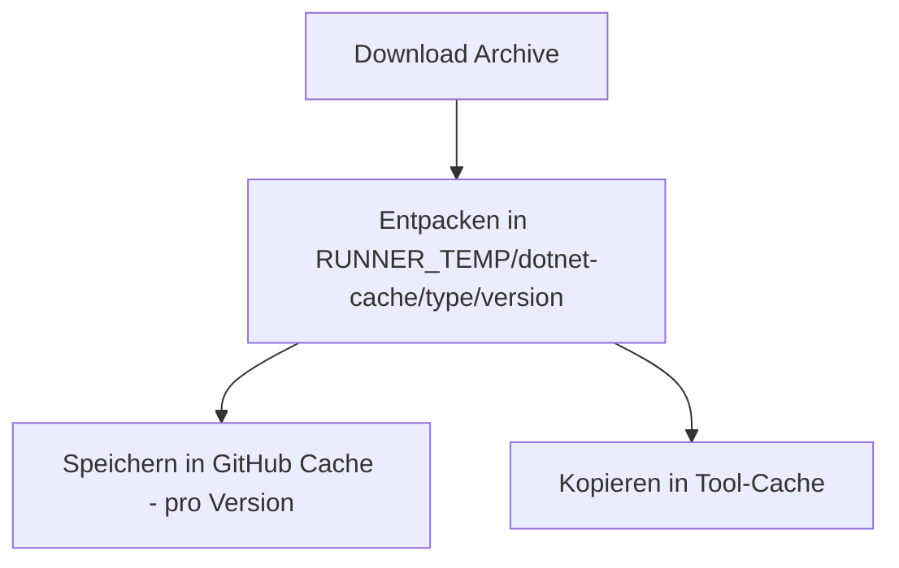
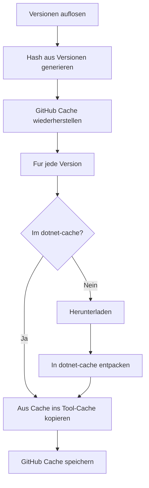

# Unified .NET Cache Refactoring

## Aktuelle Architektur (zu ersetzen)



**Probleme:**

- Viele kleine GitHub Cache-Einträge (`dotnet-{platform}-{arch}-{type}-{version}`)
- Pro-Version Cache-Keys sind ineffizient

## Neue Architektur



**Vorteile:**

- Ein GitHub Cache-Eintrag fuer alle Versionen
- `dotnet-cache` Ordner dient als GitHub-Cache UND lokaler Cache
- Deterministischer Key basierend auf aufgeloesten Versionen
- Strukturierte Ablage ohne Konflikte

## Cache-Ordner Struktur

```
RUNNER_TEMP/dotnet-cache/           <- GitHub Cache Pfad
  sdk/
    8.0.100/                         <- Entpacktes SDK-Archiv
      dotnet
      sdk/
      shared/
      host/
    9.0.100/
      ...
  runtime/
    8.0.0/                           <- Entpacktes Runtime-Archiv
      dotnet
      shared/
      host/
  aspnetcore/
    8.0.0/
      dotnet
      shared/
      host/
```

**Tool-Cache (finale Installation):**

```
RUNNER_TOOL_CACHE/dotnet/           <- Finale Installation
  dotnet                             <- Binary
  sdk/
    8.0.100/
    9.0.100/
  shared/
    Microsoft.NETCore.App/
      8.0.0/
    Microsoft.AspNetCore.App/
      8.0.0/
  host/
    fxr/
```

## Implementierungsdetails

### 1. Hash-basierter Cache Key (`[src/utils/cache-utils.ts](src/utils/cache-utils.ts)`)

```typescript
// Format: dotnet-{platform}-{arch}-{versions_hash}
// Beispiel: dotnet-linux-x64-a1b2c3d4

interface VersionEntry {
  version: string;
  type: DotnetType;
}

function generateVersionsHash(versions: VersionEntry[]): string {
  // Sortiert fuer Determinismus: erst nach type, dann nach version
  const sorted = [...versions].sort(
    (a, b) =>
      a.type.localeCompare(b.type) || a.version.localeCompare(b.version),
  );
  const data = sorted.map((v) => `${v.type}:${v.version}`).join('|');
  return crypto.createHash('sha256').update(data).digest('hex').slice(0, 8);
}

function generateUnifiedCacheKey(versions: VersionEntry[]): string {
  const platform = getPlatform();
  const arch = getArchitecture();
  const hash = generateVersionsHash(versions);
  return `dotnet-${platform}-${arch}-${hash}`;
}

function getDotnetCacheDirectory(): string {
  const runnerTemp = process.env.RUNNER_TEMP;
  if (!runnerTemp) throw new Error('RUNNER_TEMP not set');
  return path.join(runnerTemp, 'dotnet-cache');
}

function getVersionCachePath(version: string, type: DotnetType): string {
  return path.join(getDotnetCacheDirectory(), type, version);
}
```

### 2. Restore/Save Logik

```typescript
async function restoreUnifiedCache(versions: VersionEntry[]): Promise<boolean> {
  const cacheKey = generateUnifiedCacheKey(versions);
  const cachePath = getDotnetCacheDirectory();

  await io.mkdirP(cachePath);
  const restoredKey = await cache.restoreCache([cachePath], cacheKey);
  return restoredKey !== undefined;
}

async function saveUnifiedCache(versions: VersionEntry[]): Promise<void> {
  const cacheKey = generateUnifiedCacheKey(versions);
  const cachePath = getDotnetCacheDirectory();

  await cache.saveCache([cachePath], cacheKey);
}
```

### 3. Installer-Logik (`[src/installer.ts](src/installer.ts)`)

```typescript
function isVersionInCache(version: string, type: DotnetType): boolean {
  const cachePath = getVersionCachePath(version, type);
  const dotnetBinary = getPlatform() === 'win' ? 'dotnet.exe' : 'dotnet';
  return fs.existsSync(path.join(cachePath, dotnetBinary));
}

async function installVersion(options: InstallOptions): Promise<InstallResult> {
  const { version, type } = options;
  const installDir = getDotNetInstallDirectory();
  const cachePath = getVersionCachePath(version, type);

  // 1. Pruefen ob bereits im Tool-Cache installiert
  if (await isVersionInstalledInDirectory(installDir, version, type)) {
    return {
      version,
      type,
      path: installDir,
      source: 'installation-directory',
    };
  }

  // 2. Pruefen ob im dotnet-cache (von GitHub Cache restored)
  if (isVersionInCache(version, type)) {
    await copyToInstallDir(cachePath, installDir, type);
    return { version, type, path: installDir, source: 'github-cache' };
  }

  // 3. Herunterladen und in dotnet-cache entpacken
  const { url, hash } = await getDotNetDownloadInfo(version, type);
  const downloadPath = await downloadDotnetArchive(
    url,
    hash,
    `[${type.toUpperCase()}]`,
  );

  await io.mkdirP(cachePath);
  await extractArchive(downloadPath, cachePath);

  // 4. In Tool-Cache kopieren
  await copyToInstallDir(cachePath, installDir, type);

  return { version, type, path: installDir, source: 'download' };
}
```

### 4. Neuer Flow in `[src/main.ts](src/main.ts)`

```typescript
async function run(): Promise<void> {
  const inputs = readInputs();
  const requestedVersions = await resolveRequestedVersions(inputs);
  const deduplicated = await deduplicateVersions(requestedVersions);
  const versionEntries = buildVersionEntries(deduplicated);

  // 1. GitHub Cache wiederherstellen (befuellt dotnet-cache Ordner)
  let cacheRestored = false;
  if (inputs.cacheEnabled) {
    cacheRestored = await restoreUnifiedCache(versionEntries);
  }

  // 2. Alle Versionen installieren (aus Cache oder Download)
  const results = await installAllVersions(versionEntries);

  // 3. GitHub Cache speichern (falls nicht restored und nicht Windows)
  if (inputs.cacheEnabled && !cacheRestored && platform !== 'win') {
    await saveUnifiedCache(versionEntries);
  }

  configureEnvironment(getDotNetInstallDirectory());
  setOutputsFromInstallations(results);
}
```

### 5. Zu entfernende/refaktorende Komponenten

Entfernen:

- `restoreVersionCache()`, `saveVersionCache()` (pro-Version Logik)
- `restoreVersionCaches()`
- `versionCacheExists()`
- `VersionCacheResult` interface

Behalten/Refaktoren:

- `getVersionCachePath()` - anpassen fuer neue Struktur
- `isVersionCachedLocally()` -> `isVersionInCache()`

## Dateien zu aendern

| Datei                                                            | Aenderungen                                                                    |
| ---------------------------------------------------------------- | ------------------------------------------------------------------------------ |
| `[src/utils/cache-utils.ts](src/utils/cache-utils.ts)`           | Hash-Key, `restoreUnifiedCache`, `saveUnifiedCache`, alte Funktionen entfernen |
| `[src/installer.ts](src/installer.ts)`                           | `isVersionInCache()`, Entpacken in dotnet-cache, Kopieren ins Tool-Cache       |
| `[src/main.ts](src/main.ts)`                                     | Neuer Flow: Restore -> Install -> Save                                         |
| `[src/utils/cache-utils.test.ts](src/utils/cache-utils.test.ts)` | Tests fuer neue Funktionen                                                     |
| `[src/installer.test.ts](src/installer.test.ts)`                 | Tests anpassen                                                                 |

## Migration

- Neues Cache-Key-Format macht alte Caches automatisch ungueltig
- Keine Breaking Changes fuer Action-User (gleiches Interface)
